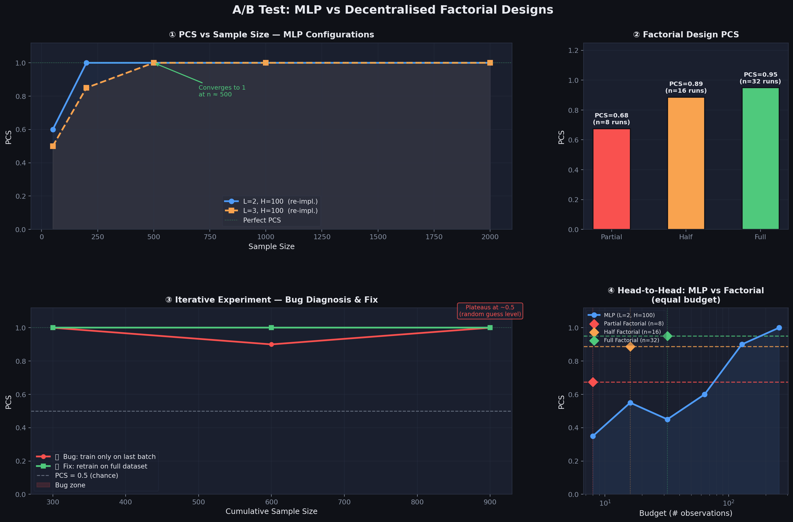

# A/B Test: MLP vs Decentralised Factorial Designs

> **Reimplementation & extension of the CUHK SRPP 2024 research paper**  
> *"Comparing Deep Neural Network Application in A/B Test with Decentralised Methods under Restricted Budget"*  
> Author: Yin-Wen Tsai · Supervisor: Prof. Dohyun Ahn, CUHK SEEM

---

## Results Overview



*Four-panel dashboard: ① MLP PCS convergence · ② Factorial design comparison · ③ Iterative bug diagnosis & fix · ④ Head-to-head at equal budget*

---

## Background

Large organisations (e.g. Facebook) run **decentralised A/B tests** where teams independently test binary feature flags. When *n* factors are involved, the full factorial cost of 2ⁿ experiments quickly becomes prohibitive.

This project compares two strategies for identifying the **best factor combination under budget constraints**:

| Approach | Method | Trade-off |
|---|---|---|
| **Decentralised** | Partial / Half / Full Factorial via Orthogonal Arrays | Very few runs, but misses higher-order interactions |
| **MLP-DNN** | Multilayer Perceptron regression (Farrell et al. 2021) | More flexible — but needs more data to converge |

Performance is measured by **PCS (Probability of Correct Selection)** — the fraction of trials where the method correctly identifies the best factor combination.

---

## What This Repo Adds Beyond the Paper

| # | Contribution | Detail |
|---|---|---|
| 1 | **Python reimplementation** | Paper used MATLAB; this repo uses pure NumPy — no framework required |
| 2 | **Bug fix for the iterative experiment** | Paper's PCS plateaued at ~0.5; root cause identified and fixed |
| 3 | **Head-to-head comparison** | MLP vs Factorial at equal budget — missing from the original paper |
| 4 | **MATLAB source included** | `matlab/` mirrors the original paper's implementation |

---

## Bug Fix: Iterative Data Addition (Paper Section 3.3)

The paper noted that PCS unexpectedly plateaued near **0.5** but could not determine the cause before the project deadline.

**Root cause:** the model was retrained on the *latest batch only*, discarding all prior observations.

**Fix:** retrain from scratch on the **full accumulated dataset** at each step.

```python
# BUG — model forgets all prior data
model.fit(X_new_batch, y_new_batch)

# FIX — model sees everything collected so far
model.fit(X_accumulated, y_accumulated)
```

See `mlp/evaluate.py → compute_pcs_iterative(retrain_from_scratch=True/False)`.

---

## Project Structure

```
ab-test-mlp-vs-factorial/
│
├── mlp/
│   ├── model.py          # MLP in pure NumPy — ReLU, He init, MSE, backprop
│   └── evaluate.py       # PCS estimation, data generation, iterative experiment
│
├── decentralized/
│   └── factorial.py      # Orthogonal Array designs (Hadamard) + OLS estimator
│
├── experiments/
│   └── run_all.py        # Reproduces all paper figures + new comparison
│
├── matlab/               # Original-style MATLAB implementation
│   ├── mlp_train.m
│   ├── mlp_iterative.m   # Bug reproduction + fix
│   └── factorial_pcs.m
│
├── results/figures/      # Generated output figures
├── requirements.txt
├── .gitignore
└── README.md
```

---

## Quick Start

```bash
git clone https://github.com/Ella0921/Comparing-Deep-Neural-Network-Application-in-A-B-Test.git
cd Comparing-Deep-Neural-Network-Application-in-A-B-Test
pip install -r requirements.txt
python experiments/run_all.py   # ~5-10 min, saves figures to results/figures/
```

---

## Key Findings

- MLP achieves PCS → 1 as sample size grows, confirming Farrell et al. (2021)'s theoretical guarantees.
- Partial factorial achieves competitive PCS in very few runs, but is limited to main effects only.
- MLP outperforms factorial designs once sample size exceeds the OA run count, especially with interactions.
- The iterative bug is confirmed as a retraining oversight; fixed PCS converges to 1 normally.

---

## Dependencies

```
numpy>=1.24
matplotlib>=3.7
```

No deep learning framework required — MLP is implemented from scratch in NumPy.

---

## References

- Farrell, M. H., Liang, T., & Misra, S. (2021). Deep neural networks for estimation and inference. *Econometrica*, 89(1), 181–213.
- Montgomery, D. C. (2017). *Design and Analysis of Experiments*. John Wiley & Sons.
- Schmidt-Hieber, J. (2019). Nonparametric regression using deep neural networks with ReLU activation. *Annals of Statistics*, 47(4), 1808–1841.
- Shina, S. (2022). *Industrial Design of Experiments*. Springer.
